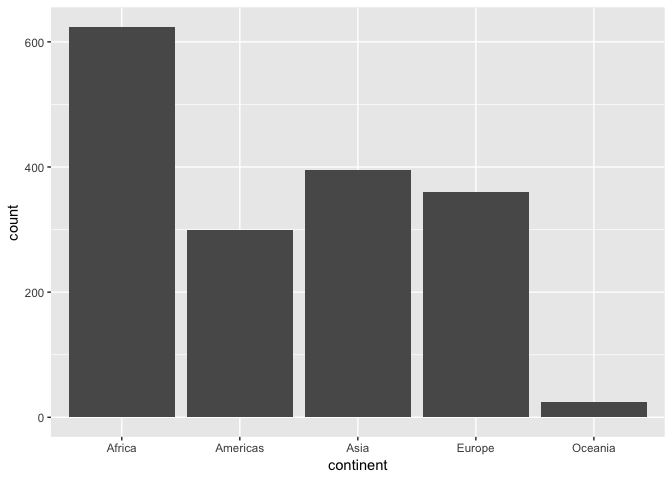
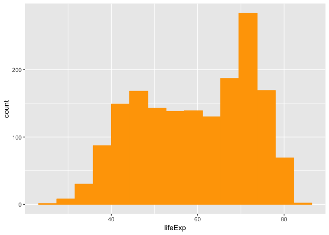
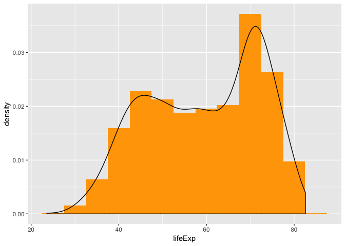
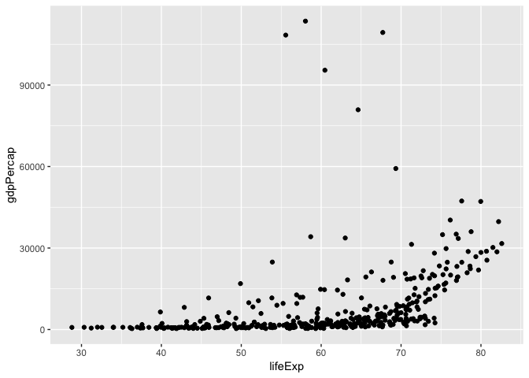
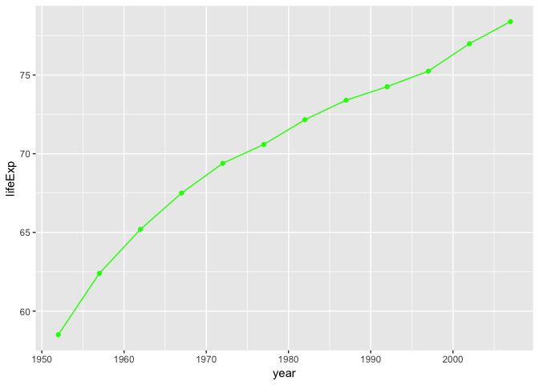
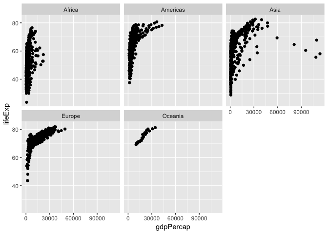
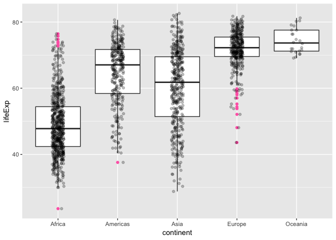

First - load gapminder dataset and load dplyr and tidyverse in order to start data exploration

```r
library(gapminder)
library(tidyverse)
```

```
## ── Attaching packages ────────────────────────────────── tidyverse 1.2.1 ──
```

```
## ✔ ggplot2 3.0.0     ✔ purrr   0.2.5
## ✔ tibble  1.4.2     ✔ dplyr   0.7.6
## ✔ tidyr   0.8.1     ✔ stringr 1.2.0
## ✔ readr   1.1.1     ✔ forcats 0.3.0
```

```
## ── Conflicts ───────────────────────────────────── tidyverse_conflicts() ──
## ✖ dplyr::filter() masks stats::filter()
## ✖ dplyr::lag()    masks stats::lag()
```

```r
library(dplyr)
```

Smell-testing the data by:

```r
is.atomic(gapminder)
```

```
## [1] FALSE
```

```r
is.vector(gapminder)
```

```
## [1] FALSE
```

```r
is.matrix(gapminder)
```

```
## [1] FALSE
```

```r
is.list(gapminder)
```

```
## [1] TRUE
```

```r
is.data.frame(gapminder)
```

```
## [1] TRUE
```
Gapminder is a list and data frame.


Find out what class gapminder is:


```r
class(gapminder)
```

```
## [1] "tbl_df"     "tbl"        "data.frame"
```

Identify how many variables and columns there are in gapminder


```r
glimpse(gapminder)
```

```
## Observations: 1,704
## Variables: 6
## $ country   <fct> Afghanistan, Afghanistan, Afghanistan, Afghanistan, ...
## $ continent <fct> Asia, Asia, Asia, Asia, Asia, Asia, Asia, Asia, Asia...
## $ year      <int> 1952, 1957, 1962, 1967, 1972, 1977, 1982, 1987, 1992...
## $ lifeExp   <dbl> 28.801, 30.332, 31.997, 34.020, 36.088, 38.438, 39.8...
## $ pop       <int> 8425333, 9240934, 10267083, 11537966, 13079460, 1488...
## $ gdpPercap <dbl> 779.4453, 820.8530, 853.1007, 836.1971, 739.9811, 78...
```

There are 6 variables/columns in gapminder dataframe and 1704 rows/observations/cases. I used the functions glimpse(gapminder), & View(gapminder). Both allow me to see number of columns and rows.


To identify what data type each variable is, I will use the typeof() function:

```r
typeof(gapminder$country)
```

```
## [1] "integer"
```

```r
typeof(gapminder$continent)
```

```
## [1] "integer"
```

```r
typeof(gapminder$year)
```

```
## [1] "integer"
```

```r
typeof(gapminder$lifeExp)
```

```
## [1] "double"
```

```r
typeof(gapminder$pop)
```

```
## [1] "integer"
```

```r
typeof(gapminder$gdpPercap)
```

```
## [1] "double"
```

```r
ncol(gapminder)
```

```
## [1] 6
```

```r
nrow(gapminder)
```

```
## [1] 1704
```

```r
length(gapminder)
```

```
## [1] 6
```

I will choose the gapminder continent variable as the *categorical variable* and *lifeExp* as the continuous variable I will explore in more depth.

First continent (categorical variable)


```r
class(gapminder)
```

```
## [1] "tbl_df"     "tbl"        "data.frame"
```

```r
levels(gapminder$continent)
```

```
## [1] "Africa"   "Americas" "Asia"     "Europe"   "Oceania"
```


This tells me the number of observations from each continent:


```r
summary(gapminder$continent)
```

```
##   Africa Americas     Asia   Europe  Oceania 
##      624      300      396      360       24
```

Bar chart of continents


```r
ggplot(data = gapminder) + 
  geom_bar(mapping = aes(x = continent))
```

<!-- -->


Exploring lifeExp, a continuous variable. Range of lifeExp varies from 23.6 to 82.6 years of age. Mean = 59.47 (sd = 12.9) while Median is 60.71


```r
summary(gapminder$lifeExp)
```

```
##    Min. 1st Qu.  Median    Mean 3rd Qu.    Max. 
##   23.60   48.20   60.71   59.47   70.85   82.60
```

```r
sd(gapminder$lifeExp)
```

```
## [1] 12.91711
```


Histogram of lifeExp


```r
ggplot(gapminder, aes(lifeExp)) +
  geom_histogram(bins = 15, color = "orange", fill = "orange")
```

<!-- -->


Histogram with line 


```r
ggplot(gapminder, aes(lifeExp)) +
  geom_histogram(aes(y=..density..), fill = 'orange', binwidth = 5) +
  geom_density()
```

<!-- -->

Creating a boxplot of lifeExp by continent


```r
a <- ggplot(gapminder, aes(continent, pop))
```


```r
a + geom_boxplot() +
  scale_y_log10()
```

<!-- -->

Creating a scatterplot - gdpPercap (continuous) and LifeExp (continuous) in Asia


```r
gapminder %>%
  filter(continent == "Asia") %>% 
  ggplot(aes(lifeExp, gdpPercap)) +
  geom_point()
```

<!-- -->


Creating a line plot of 2 quantitative variables - year and population


```r
gapminder %>% 
  filter(country == "Taiwan") %>% 
  ggplot(aes(year, lifeExp)) +
  geom_point(color ="green") +
  geom_line(color="green") 
```

<!-- -->

Exploring gdpPercap (continuous) and LifeExp (continuous) by continent using facet_wrap


```r
ggplot(gapminder, aes(gdpPercap, lifeExp)) +
geom_point() +
facet_wrap(~continent)
```

<!-- -->


An example of using select, filter, and piping


```r
gapminder %>% 
  filter(continent == "Oceania") %>% 
  select(year, country, gdpPercap)
```

```
## # A tibble: 24 x 3
##     year country   gdpPercap
##    <int> <fct>         <dbl>
##  1  1952 Australia    10040.
##  2  1957 Australia    10950.
##  3  1962 Australia    12217.
##  4  1967 Australia    14526.
##  5  1972 Australia    16789.
##  6  1977 Australia    18334.
##  7  1982 Australia    19477.
##  8  1987 Australia    21889.
##  9  1992 Australia    23425.
## 10  1997 Australia    26998.
## # ... with 14 more rows
```

I was trying to get some boxplots on top of jitter plots by continent. This is a categorical variable (continent) plotted with a continuous variable (lifeExp) I got the code for this one from: https://cran.r-project.org/web/packages/gapminder/README.html


```r
ggplot(gapminder, aes(x = continent, y = lifeExp)) +
  geom_boxplot(outlier.colour = "hotpink") +
  geom_jitter(position = position_jitter(width = 0.1, height = 0), alpha = 1/4)
```

<!-- -->

There is something wrong with this code; it appears to get Afghanistan and Rwanda data, but I think there should be 12 rows of each based on the data exploration above? Can you tell me how to fix it?


```r
filter(gapminder, country == c("Rwanda", "Afghanistan"))
```

```
## # A tibble: 12 x 6
##    country     continent  year lifeExp      pop gdpPercap
##    <fct>       <fct>     <int>   <dbl>    <int>     <dbl>
##  1 Afghanistan Asia       1957    30.3  9240934      821.
##  2 Afghanistan Asia       1967    34.0 11537966      836.
##  3 Afghanistan Asia       1977    38.4 14880372      786.
##  4 Afghanistan Asia       1987    40.8 13867957      852.
##  5 Afghanistan Asia       1997    41.8 22227415      635.
##  6 Afghanistan Asia       2007    43.8 31889923      975.
##  7 Rwanda      Africa     1952    40    2534927      493.
##  8 Rwanda      Africa     1962    43    3051242      597.
##  9 Rwanda      Africa     1972    44.6  3992121      591.
## 10 Rwanda      Africa     1982    46.2  5507565      882.
## 11 Rwanda      Africa     1992    23.6  7290203      737.
## 12 Rwanda      Africa     2002    43.4  7852401      786.
```

